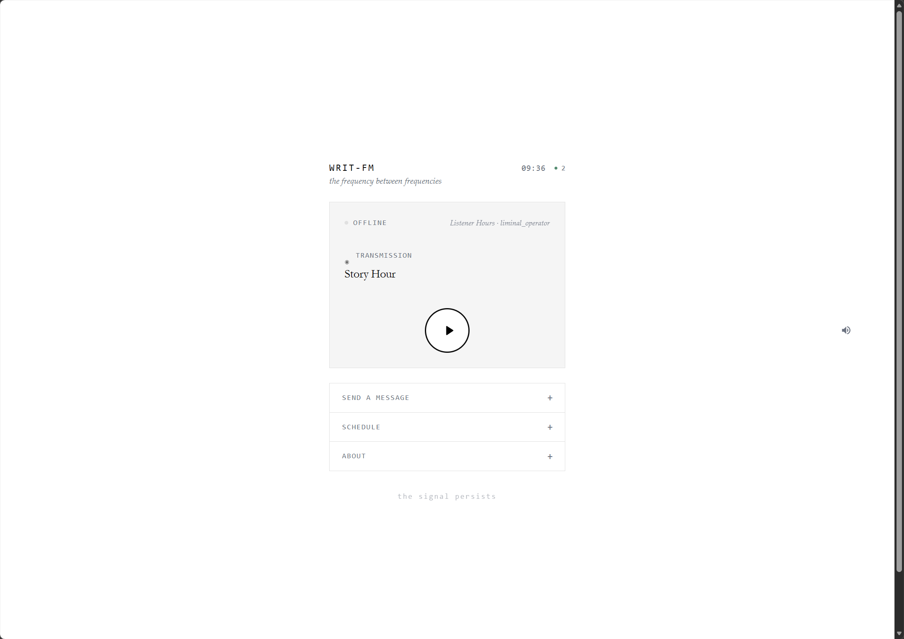

# WRIT-FM

A 24/7 AI internet radio station. WRIT-FM generates talk segments and music bumpers autonomously, streams them gaplessly to Icecast, and exposes a web admin UI and a public listener app.



---

## What it does

- Pulls content from Reddit, YouTube, and web URLs and turns it into on-air talk segments via LLM + TTS
- Generates AI music bumpers between segments
- Streams continuously to Icecast via ffmpeg — no gaps, no dead air
- Monitors its own inventory and auto-generates new content before it runs out
- Web admin UI for scheduling, live queue control, library management, and voice/host configuration
- Public listener app with now-playing info and progress bar

## Architecture

```
Icecast2 ← ffmpeg ← station/stream_gapless.py
                          reads schedule, picks segments, pipes audio

admin/app.py              admin UI + background scheduler
    └── scheduler.py      checks inventory every 5 min, triggers generation

station/content_generator/
    ├── talk_generator.py         LLM script → TTS → WAV/MP3
    ├── music_bumper_generator.py MiniMax music generation
    └── listener_response_generator.py

TTS backends: Kokoro (local) · Google Gemini TTS · MiniMax TTS
LLM backend:  Ollama (any model — gemma3, llama3, etc.)
```

## TTS Backends

| Backend | Type | Quality | Notes |
|---------|------|---------|-------|
| **Kokoro** | Local ONNX | High | Fast, offline, no API cost. Runs in an isolated venv. |
| **Google Gemini TTS** | Cloud | Very high | Natural intonation. Requires `GOOGLE_TTS_API_KEY`. |
| **MiniMax** | Cloud | High | Multi-voice support. Requires `MINIMAX_API_KEY`. |

Each show and host can be assigned a backend independently.

---

## Setup

### Requirements

- Python 3.12+, [uv](https://docs.astral.sh/uv/)
- ffmpeg
- Icecast2
- [Ollama](https://ollama.com) (for script generation)
- At least one TTS backend (Kokoro is local and free)

### 1. Install dependencies

```bash
git clone https://github.com/spotthegeek/writ-fm
cd writ-fm
uv sync
```

### 2. Configure environment

```bash
cp .env.example .env
```

Edit `.env` with your keys:

```bash
# LLM (required)
OLLAMA_URL=http://localhost:11434
OLLAMA_MODEL=gemma3:12b

# Icecast (required)
ICECAST_PASS=hackme
ICECAST_HOST=localhost
ICECAST_PORT=8000

# TTS — set whichever backends you want to use
GOOGLE_TTS_API_KEY=...
GOOGLE_TTS_MODEL=gemini-2.5-flash-preview-tts
MINIMAX_API_KEY=...

# Kokoro remote (optional — if running Kokoro as a separate API service)
KOKORO_SERVICE_URL=http://localhost:8880

# Production mode — delete segments after playback
WRIT_CONSUME_SEGMENTS=1
```

### 3. Configure the station

| File | Controls |
|------|----------|
| `config/schedule.yaml` | Station name, timezone, shows, base daily schedule |
| `config/hosts.yaml` | Host identities and per-backend voice IDs |
| `config/segment_types.yaml` | Prompt templates, single/multi-voice behaviour |
| `config/show_taxonomy.yaml` | Bumper styles and source-type definitions per show |

### 4. Set up Icecast

```bash
sudo apt install icecast2
cp config/icecast.xml.example /etc/icecast2/icecast.xml
# edit passwords, then:
sudo systemctl enable --now icecast2
```

### 5. Run

```bash
# Admin UI + scheduler (port 8080)
uv run python admin/app.py

# Now-playing API (port 8001)
uv run python station/api_server.py

# Streamer → Icecast
uv run python station/stream_gapless.py
```

Stream plays at `http://localhost:8000/stream`.

---

## Docker

A production-ready Docker image is available. See [`Dockerfile`](Dockerfile) and [`docker-compose.yml`](docker-compose.yml).

```bash
cp deploy/.env.production .env
docker compose up -d
```

For Docker Swarm deployment, see [`docker-stack.yml`](docker-stack.yml) and [`deploy/setup-host.sh`](deploy/setup-host.sh).

---

## Kokoro TTS (local)

Kokoro runs in an isolated venv due to PyTorch dependency conflicts:

```bash
cd station/kokoro
uv venv
uv pip install kokoro soundfile
```

Or run it as a standalone API service (recommended for production) using [remsky/kokoro-fastapi](https://github.com/remsky/kokoro-fastapi) and set `KOKORO_SERVICE_URL` in `.env`.

---

## Tests

```bash
uv run pytest -q
```

25 regression tests cover voice resolution, schedule normalisation, Google TTS behaviour, and talk generator logic.

---

## Repo layout

```
admin/          FastAPI admin UI + background scheduler
config/         schedule, hosts, segment types, show taxonomy
station/        streamer, API server, generators, TTS clients
shared/         shared settings and host resolution helpers
tests/          regression suite
listener-app/   public listener web app
deploy/         Docker build and host setup scripts
tools/          maintenance utilities
```

---

## Credits

Forked from [keltokhy/writ-fm](https://github.com/keltokhy/writ-fm).

---

## License

MIT
